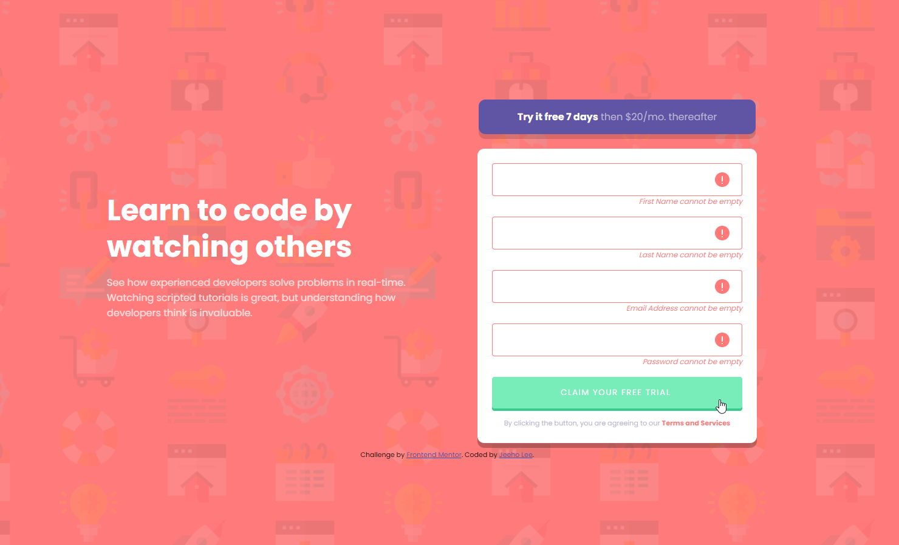

# Frontend Mentor - Intro component with sign up form solution

This is a solution to the [Intro component with sign up form challenge on Frontend Mentor](https://www.frontendmentor.io/challenges/intro-component-with-signup-form-5cf91bd49edda32581d28fd1). Frontend Mentor challenges help you improve your coding skills by building realistic projects. 

## Table of contents

- [Overview](#overview)
  - [The challenge](#the-challenge)
  - [Screenshot](#screenshot)
  - [Links](#links)
- [My process](#my-process)
  - [Built with](#built-with)
  - [What I learned](#what-i-learned)
  - [Continued development](#continued-development)
  - [Useful resources](#useful-resources)
- [Author](#author)
- [Acknowledgments](#acknowledgments)

## Overview

### The challenge

Users should be able to:

- View the optimal layout for the site depending on their device's screen size
- See hover states for all interactive elements on the page
- Receive an error message when the `form` is submitted if:
  - Any `input` field is empty. The message for this error should say *"[Field Name] cannot be empty"*
  - The email address is not formatted correctly (i.e. a correct email address should have this structure: `name@host.tld`). The message for this error should say *"Looks like this is not an email"*

### Screenshot

### Links

- Solution URL: [https://github.com/jeeheezy/FEM-Intro-Component-SignUp](https://github.com/jeeheezy/FEM-Intro-Component-SignUp)
- Live Site URL: [https://jeeheezy.github.io/FEM-Intro-Component-SignUp/](https://jeeheezy.github.io/FEM-Intro-Component-SignUp/)

## My process

### Built with

- Semantic HTML5 markup
- CSS custom properties
- Flexbox
- CSS Grid
- Mobile-first workflow
- Javascript

### What I learned

This was my first time using Javascript for Front End Mentor, and there were definitely some key things that I had forgotten that I'd like to make note of.

First is that querySelectorAll returns a NodeList and not an array, so to use .map it had to be converted. Another thing to consider was remembering to use a e.preventDefault to prevent reloading when submitting the HTML forms so I could work with the DOM elements and display the changes. 

One thing I found very interesting through this project was when looking to add in email validation. It seems a lot more complicated with RFC822 or EFC2822 being mentioned, and as many people pointed out in a Stack Overflow thread, simple regex is not a reliable way for email validation. There are other methods for validation so for the purposes of this challenge, I added in a very simplistic regex that checks for some number of non-whitespace characters followed by "@" followed by more characters, then a ".", and then more characters. 

### Continued development

I'm still very rusty with getting back into Javascript, so definitely hoping to get some more practice with vanilla Javascript before looking at any frameworks!

### Useful resources

- [Stack Overflow Thread](https://stackoverflow.com/questions/46155/how-can-i-validate-an-email-address-in-javascript?page=1&tab=scoredesc#tab-top*/) - This thread helped explain some of the complexities of why regex isn't the best method for email validation in Javascript, and other considerations when trying to implement the feature. 

## Author

- LinkedIn - [Jeeho Lee](https://www.linkedin.com/in/jeeho-lee-719852182/)
- Frontend Mentor - [@jeeheezy](https://www.frontendmentor.io/profile/jeeheezy)

